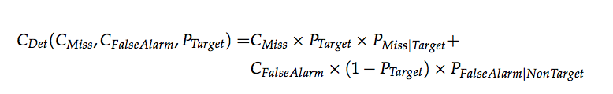
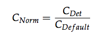
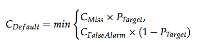

##### 1. i-vector的提取

> 例子Voxceleb v1：egs/voxceleb/v1/run.sh
>
> ivector的提取方式：
>
> ###### 1.1 训练 diag 和 full UBM
> - 训练diag UBM
>
> 源文件：egs/voxceleb/v1/sid/train_diag_ubm.sh
>
> 使用特征进行GMM初始化：src/gmmbin/gmm-global-init-from-feats.cc

##### 2.计算在对Verification任务进行打分的指标**min_DCF**

> 源文件：
> kaldi/egs/voxceleb/v2/sid/compute_min_dcf.py
>
> min_DCF的计算方式：
>
> - 计算fnr(小于阈值而被认为是反例的正例在所有正例的样本比重)和fpr(大于阈值而被认为是正例的反例在所有反例中的样本比重)
> - 计算并找到最小的c_det，以及对应的score阈值

> - 对c_det进行正则化
>
> 
> 
> 其中正则化的分母为：
>
> 

2019年08月28日

##### 3.计算EER(Equal Error Rate)

> 源文件：
> src/ivectorbin/compute-eer.cc
>
> EER的计算方式：
>
> 

